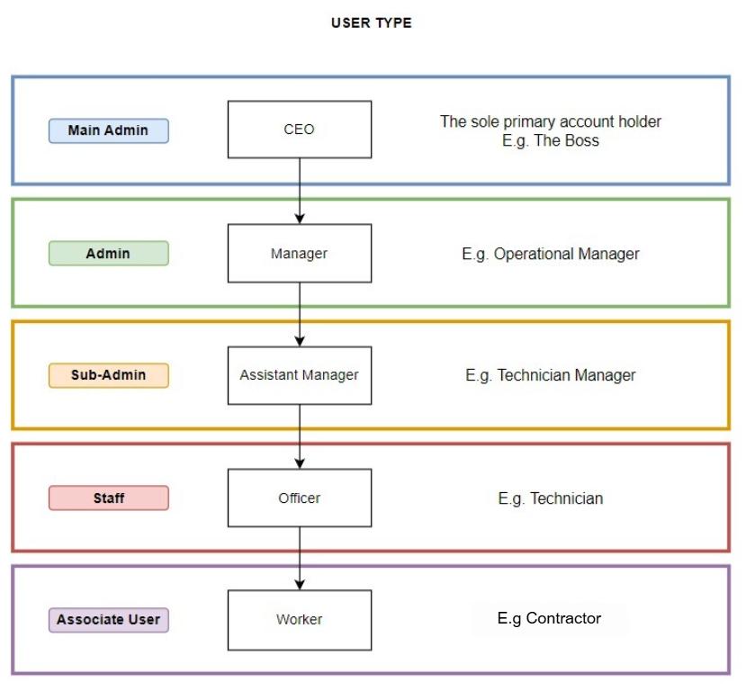
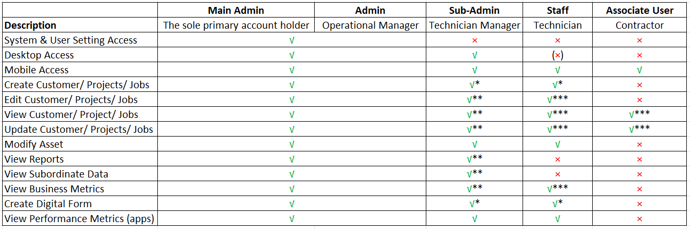
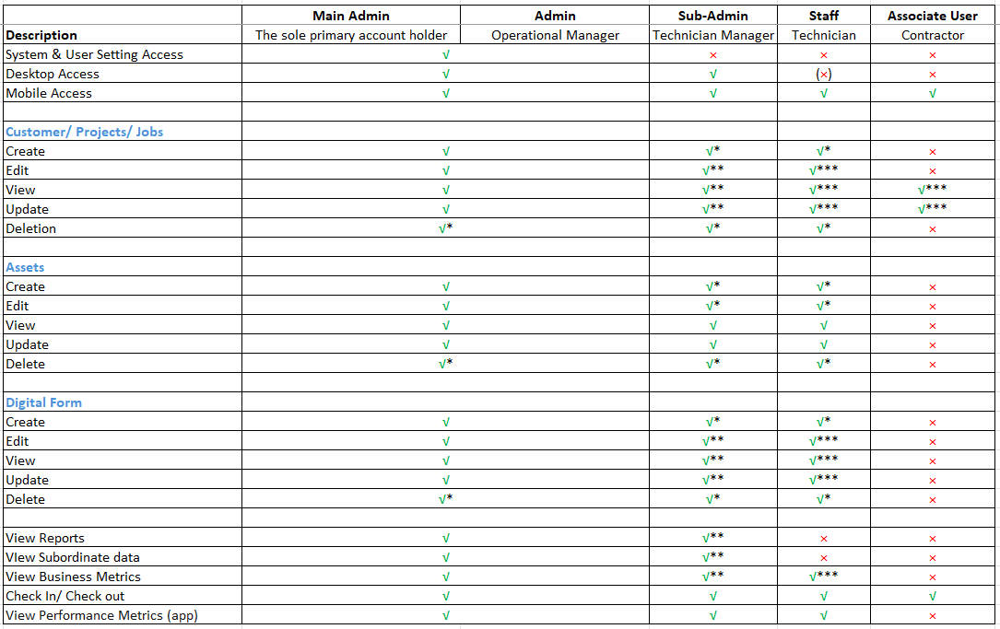

Version 1.0 
Created: 24 May 2024 
Updated: 10 June 2024 
##  What is user type? 

User type sets what a user can see in the system. For instance, an Admin can see everything, including others' schedules and jobs, but a Staff can't.  

There are 5 user types: Main Admin, Admin, Sub Admin, Staff, and Associate User. 

   

 

## User Type Default Access
**Basic:**
 
 

    
  

**Advanced:**
 

    
  

\* Depends on system setting  
** Only within department  
*** Only view the data they created themselves or assign to them  
( ) Optional

  
 

## What is the difference between Default, Allow Access, and Block Access on User Account Customization? 

|    Default    | Based on the system’s default settings for different account types: Admin - Can create anything, Subadmin - Can create items under their department/teams, Staff - Cannot create Customer/Project/Job/Digital Form |
| :-----------: | :------------------------------------------------------------------------------------------------------------------------------------------------------------------------------- |
|  Allow access | Users can create Customer/Project/Job/Digital Form for items that they are assigned to.  |
|  Block access | Users will not be able to create Customer/Project/Job/Digital Form under any circumstances. |

 

## What is the staff category?

Staff category refers to the department/team each staff can be placed in. After placing staff in different categories, you can easily assign tasks to teams, check staff’s schedules based on teams, assign Sub Admin to 
each team, etc. Note that a user can be in more than one Staff Category and a user cannot be without a Staff Category.
 

\* To manage staff category (edit/delete): Company Settings > Staff Settings > Department/Team Settings > Staff Category. 
\** To edit the category a staff belongs in: User Management > User List. Click the blue pen button beside the relevant user, edit under “Staff Category”, and click “Submit.”  
\*** Only the Desktop site and admins can manage staff settings 

   

**Related Articles** 
- [How to add new user category?](Add_New_User_Category.md) 
- [Data Level Structure](Data_Level_Structure.md)

<!-- [Link Text](https://salesconnection.github.io/Sales-Connection-Support/User_Types_Default_Access.html) -->
