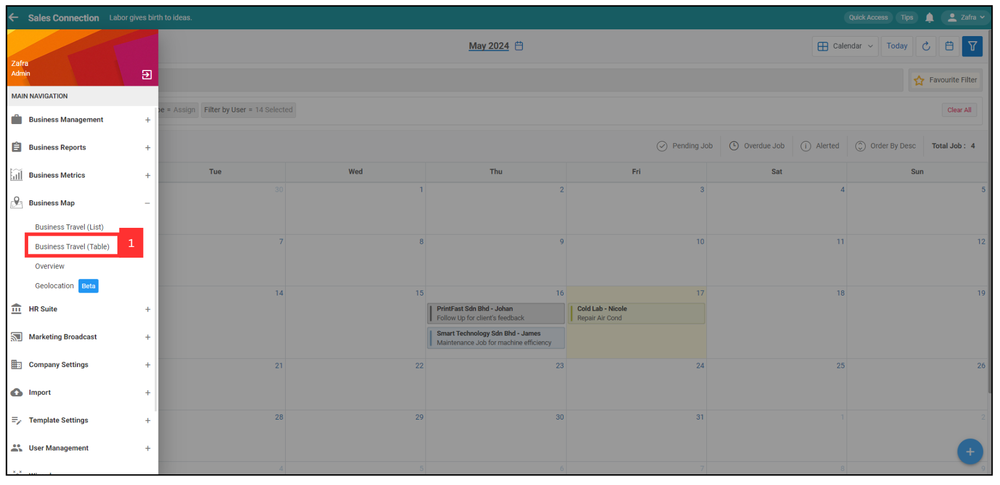
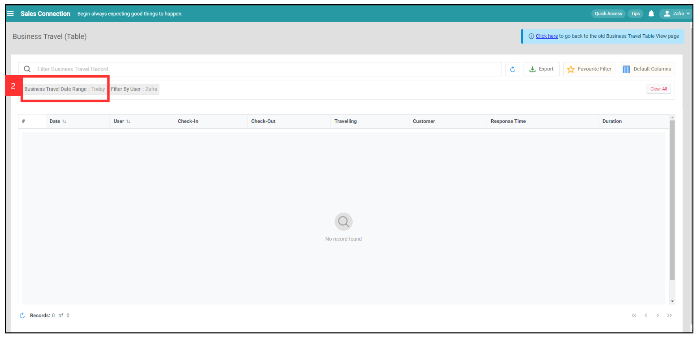
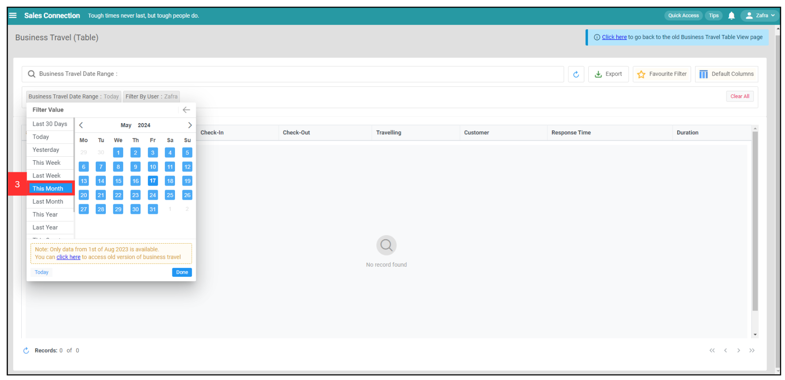
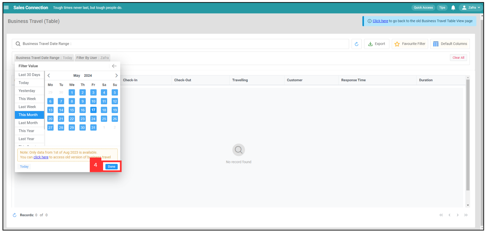
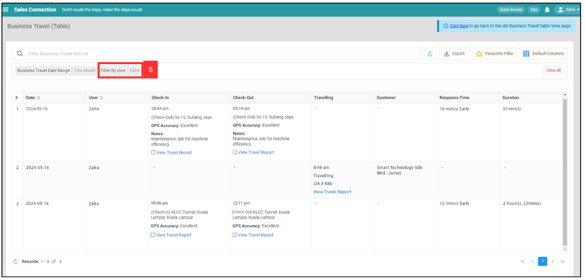
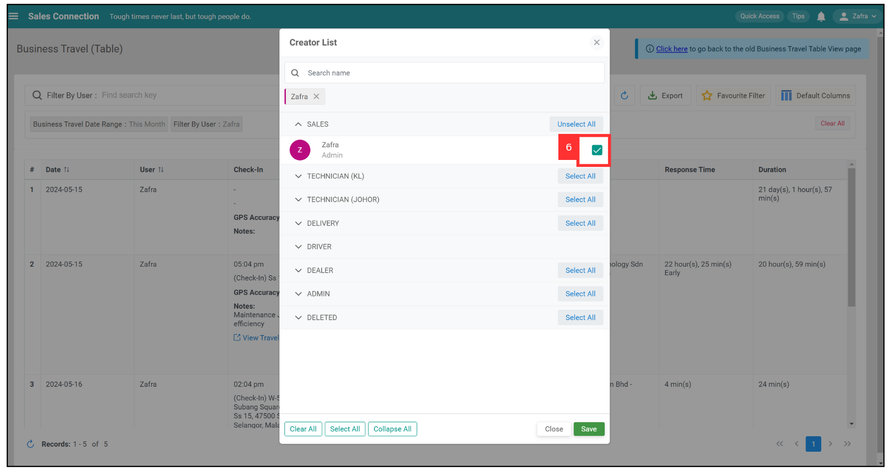
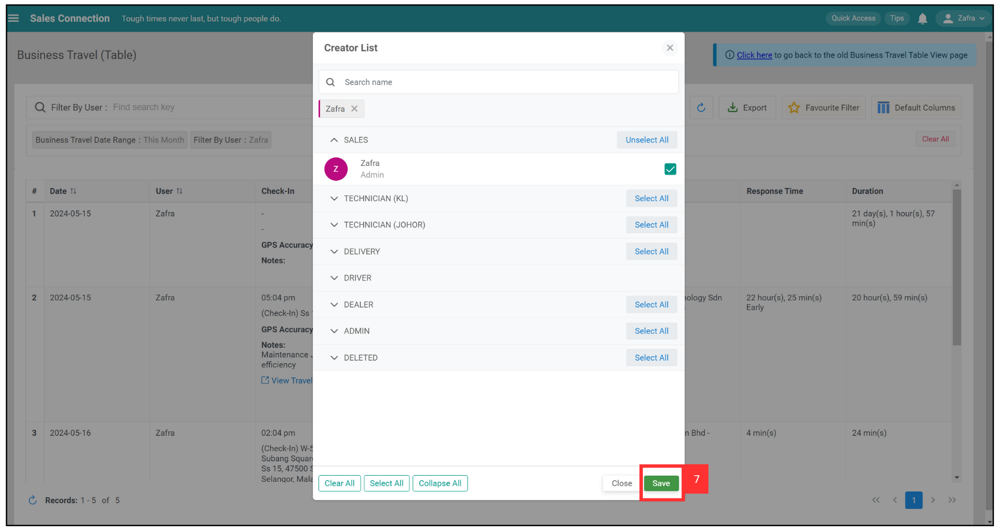
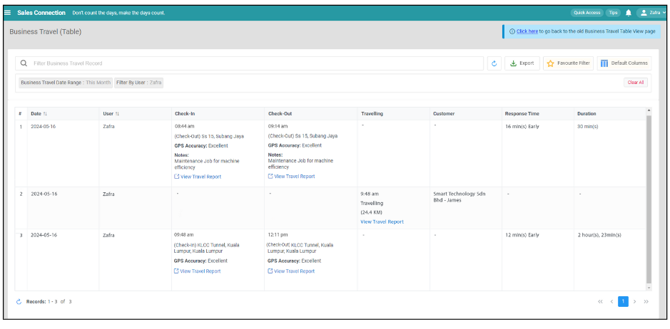

## Where can I view my team’s traveling for the month?

1. For example, you want to view your team's traveling for the month. Go to desktop site Main Navigation > Business Map > Business Travel (Table)   
   **Open the page here**: [https://salesconnection.my/business-travel/table](https://salesconnection.my/business-travel/table) 

   

     
   
 

2. Click "Business Travel Date Range" to select the date range you want to view.

   

     
   
 

3. Select the data range.

   

     
   
 

4. Click "Done".

   

     
   
 

5. Click "Filter by User" to select a specific department or users.

   

     
   
 

6. For example, select Sales Department by tick it.

   

     
   
 

7. Click "Save".

   

     
   
 

8. The result will then be shown.

   

      
   

### What is the definition between Response Time and Duration? 

|   Term  | Definition |
| :-----------: | :-------------------------------------------------------------------------------------------------------------------------------------------------------------------------------: |
| Response Time | The difference between the user's Check-In time and the scheduled Check-in time   |
|  Duration | Time Duration between user's Check-In and Check-Out|

