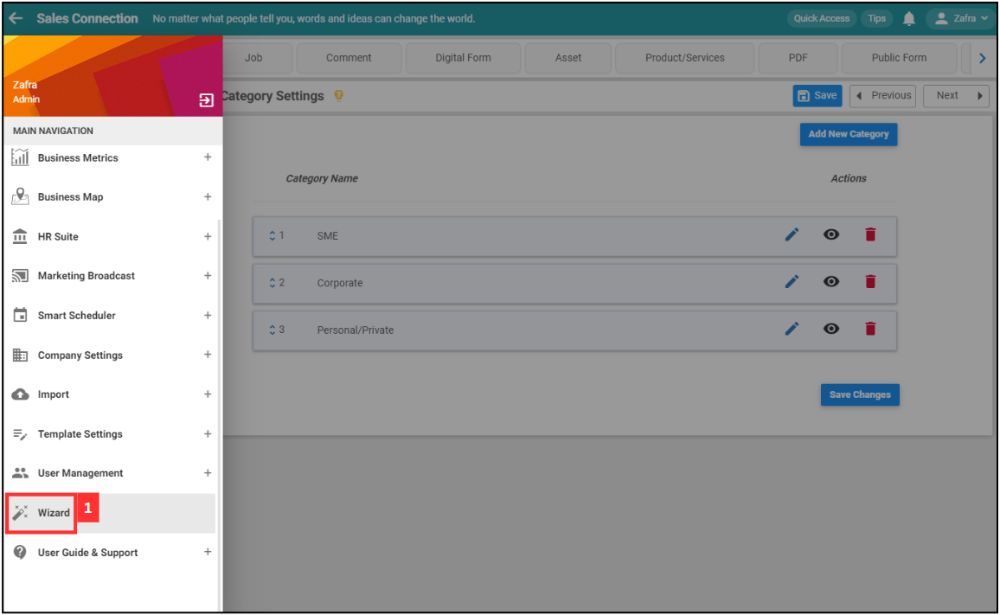
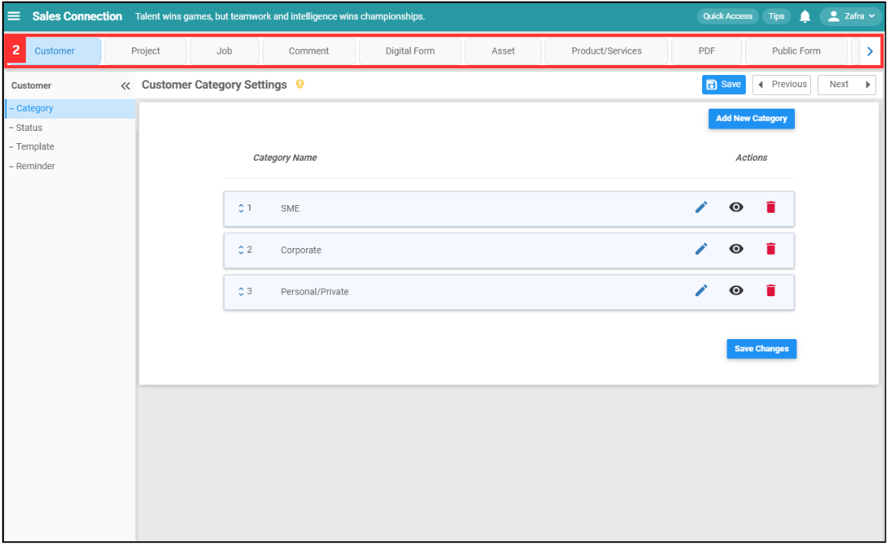
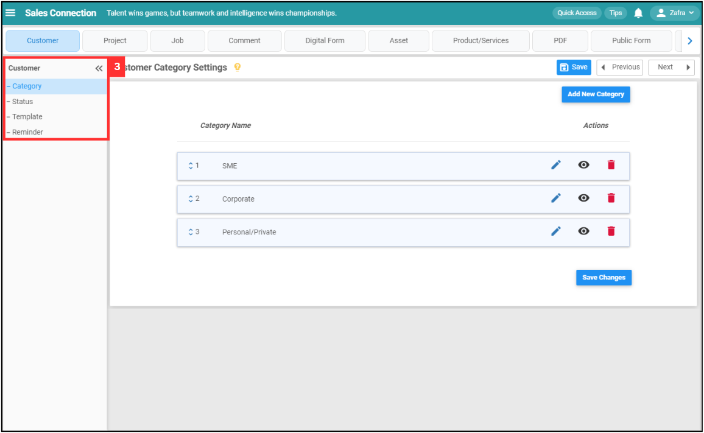
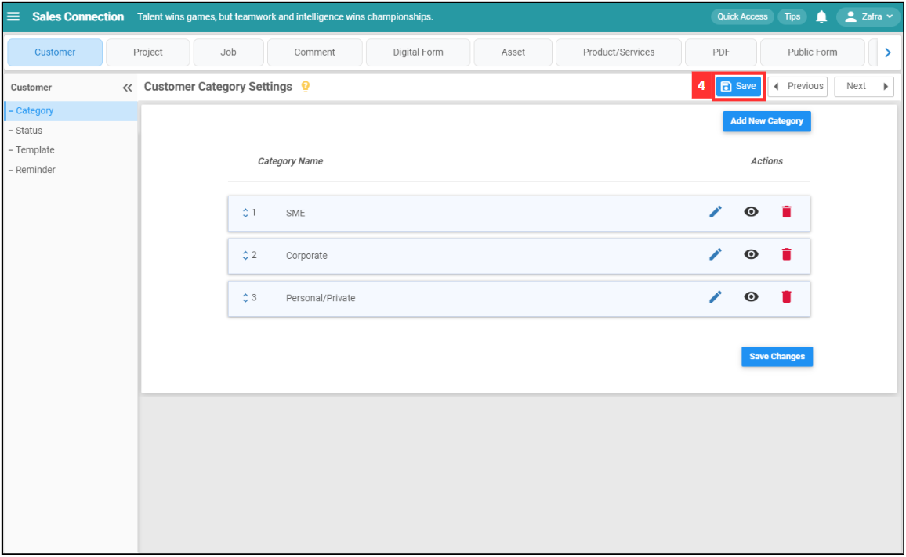
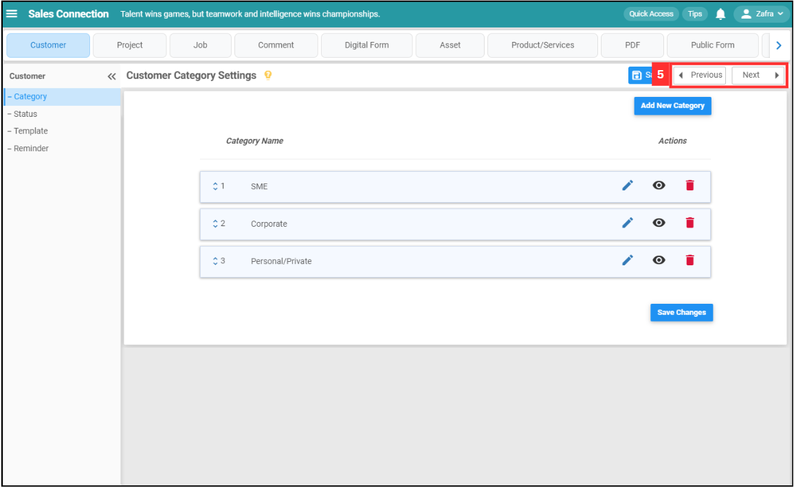

Version 1.0 
Created: 16 July 2024 
Updated: 16 July 2024 
## Wizard Page

**Wizard page** is a shortcut to navigate between the different setting pages (ie. Template Setting, Reminder Setting, Category Setting, etc.)  

1. At the desktop site navigation bar, go to Wizard. 
   **Open Wizard Page Here:** [https://salesconnection.my/wizard](https://salesconnection.my/wizard) 

   

      
   

   *Note: Please contact your Admin if you do not have access to this page. Only few users are allowed to have access to the Wizard page. 
        
2. Click to select the menu.

   

      
   

  
3. After selecting the menu, click on the sub-menu.

   

      
   

  
4. Click on the "Save" icon after editing to save your changes.

   

      
   

  
5. Click "Previous" if you wish to access the previous sub-menu page while clicking "Next" if you wish to access the next sub-menu page.

   

      
   

      

**Related Articles**
- [Data Level Structure](Data_Level_Structure.md)
- [User Type Default Access](User_Types_Default_Access.md)

<!-- [Link Text](https://salesconnection.github.io/Sales-Connection-Support/Wizard_Page.html) -->
