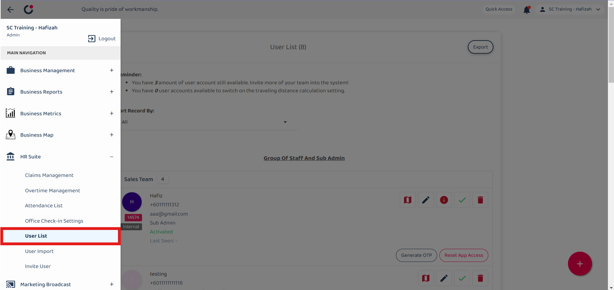
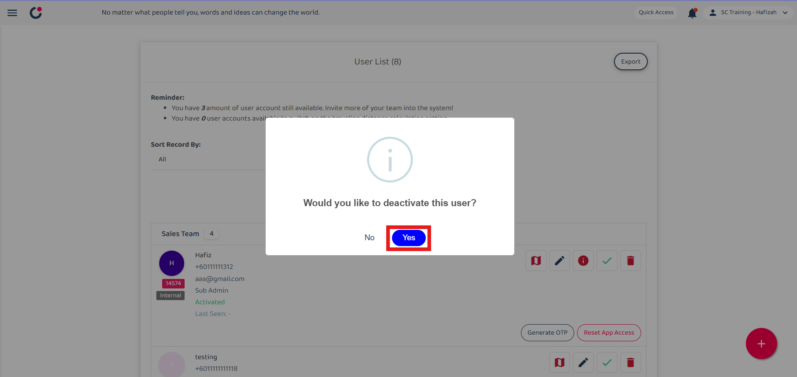
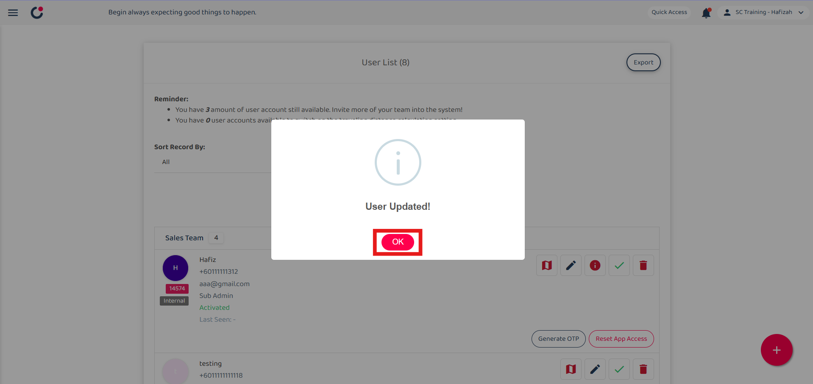

Version 1.0 
Created: 24 May 2024 
Updated: 23 January 2025 
## How to Deactivate a Resigned User?

**Differences between delete, deactivate and replace user**

|   |  Delete   |   Deactivate   |   Replace  |
|-------|----------|----------------|------------|
| User can access the system. | No | No | Yes |
| Data will remain in the system. | No | Yes | Yes |
| The users’ jobs can be traced in the schedule and metrics overview pages. | No | Yes | Yes |

  
**Navigate to others.** 
- [How to Delete a Resigned User?](Delete_User.md)
- [How to Replace Resigned User with A New User in The System?](Replace_User.md)
   

## Deactivate a Resigned User
### What happens when a user is deactivated?
- The user can't login to the system. 
- The user's data will still stay in the system (e.g. Assigned to/ Creator column, job schedule, metrics, etc.) 
- A deactivated user account is not counted as one.  

### How to deactivate a user?
1. On the desktop site, go to the navigation bar, select HR Suite, then click User List. 
   **Open User List Page Here:** [https://system.caction.com/usermanage/userlist](https://system.caction.com/usermanage/userlist) 
   *Note: Only certain admins can deactivate users. 

   

      
   

   
2. Navigate to the user you want to deactivate. 

   

      
   

3. Click on the "Green Tick" icon to deactivate the user. 

   

      
   

4. Click "Yes" to confirm your deactivation. 

   

      
   

5. Click "OK" and the user has been deactivated successfully. 

   

      
   

      

**Related Articles** 
- [How to Add New User?](Add_New_User.md)
- [How to Assist My New User to Login?](New_User_Login.md)
- [How to Login Into Caction Using Mobile and Desktop?](Login.md)

<!-- [Link Text](https://support.caction.com/Delete,_Deactivate_or_Change_User.html) -->
