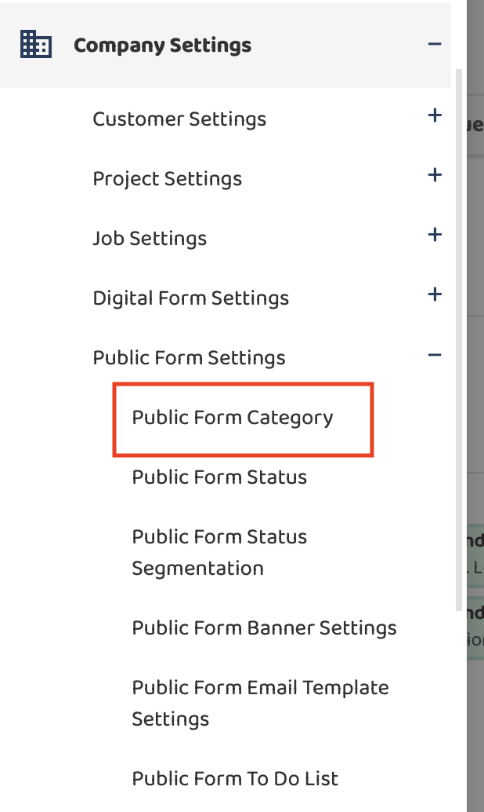
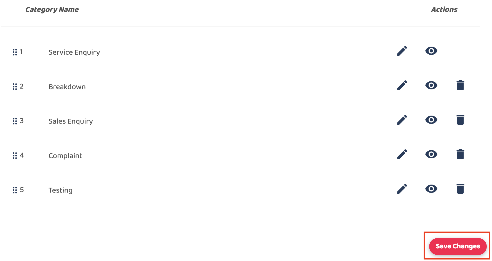

## How to Add New Category From Public Form

1. At the desktop site's navigation bar, go to Company Settings > Public Form Settings > Public Form Category. 
   **Add New Category Here:** [https://system.caction.com/PublicForm/PfCategorySettings](https://system.caction.com/PublicForm/PfCategorySettings) 

  

         
       

2. Click on the "Add New Category" button, you can write the category inside the text field.
   Enter the name of the new user category and click “Submit”. 
   
   

       
     

3. Click on the "Save Changes" to save. 

  

       
     

